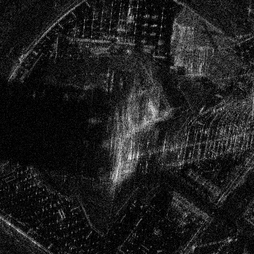

# CuBP 

a python based tool for comparing SAR backprojection algorithm speed with in various implementations. The goal is to 
include numpy, cupy, and a custom cuda implementation via pybind bindings. 

## Prerequisite

This project is managed by [uv](https://docs.astral.sh/uv/). Follow the installation instructions there to get started.

## Installation 
Once you clone the repo and have uv installed, you can create a virtual environment with: 
```
uv venv .venv 
```

After, running `uv sync` will install cubp in editable mode into your environment. the repository is set up to utilize 
scikit-build and pybind to automatically generate python bindings for any bindings declared as part of `libcubp`. If 
installed correctly, and the virtual environment active, running `cubp --help` should print the following: 
 ```
usage: cubp [-h] [--cphd_file Path] [--image_bounds [JSON]] [--image_bounds.x int] [--image_bounds.y int] [--pulse_limit int] [--image_spacing float] [--output_file Path] [--target [{JSON,null}]] [--target.lon {float,null}] [--target.lat {float,null}]
            [--target.alt {float,null}] [--backend {numpy,cupy,cuda}] [--log_file {str,null}] [--log_level str]

options:
  -h, --help            show this help message and exit
  --cphd_file Path      Path to CPHD file to run bp on. (required)
  --pulse_limit int     number of pulses to use during image formation. (default: -1)
  --image_spacing float
                        spacing between pixels in meters. (default: 0.5)
  --output_file Path    path to output a formed image to. (default: out.png)
  --backend {numpy,cupy,cuda}
                        Backend implementation to use. (default: numpy)
  --log_file {str,null}
                        optional file to write logs to. (default: null)
  --log_level str       log level to be used. (default: DEBUG)

image_bounds options:
  Image bounds for produced image.

  --image_bounds [JSON]
                        set image_bounds from JSON string (default: {})
  --image_bounds.x int  (default: 512)
  --image_bounds.y int  (default: 512)

target options:
  default: null (undefined)
   geodetic location of target

  --target [{JSON,null}]
                        set target from JSON string (default: {})
  --target.lon {float,null}
                        (default: null)
  --target.lat {float,null}
                        (default: null)
 ```

## Example 
An example output of the process can be generated by running `CuBP_CONFIG+="jeddah-tower.yaml" CuBP` from the 
sample-data directory. Below is an example of the produced image: 



This sample took about 4 minutes and 20 seconds to generate using the numpy backend. 